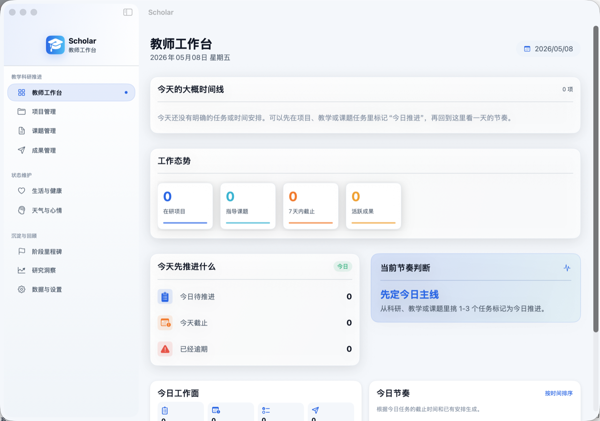
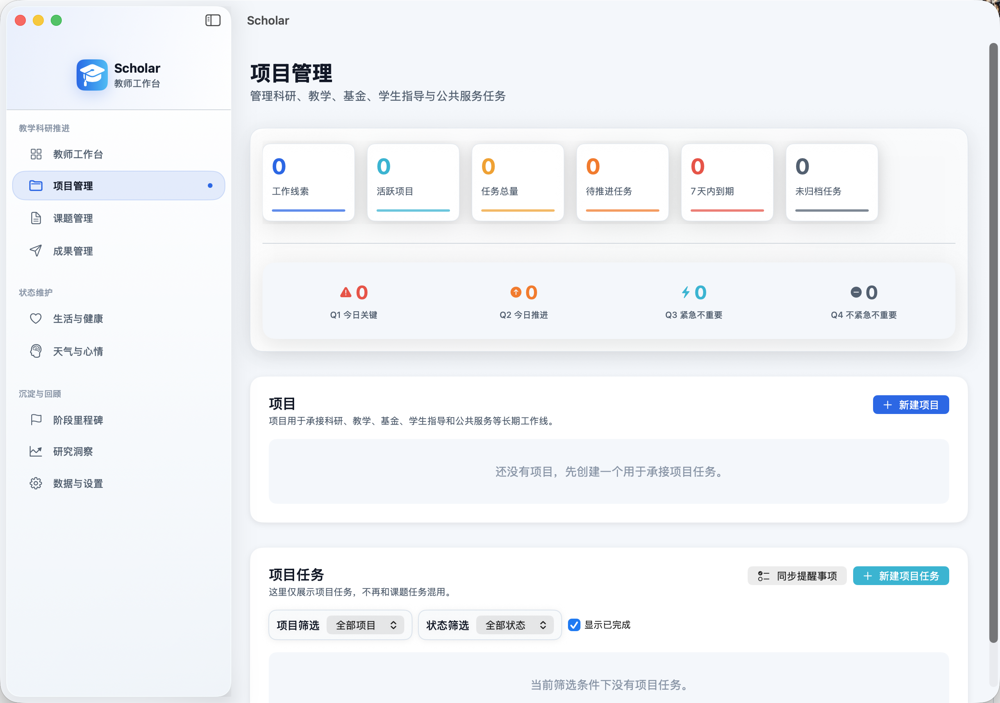
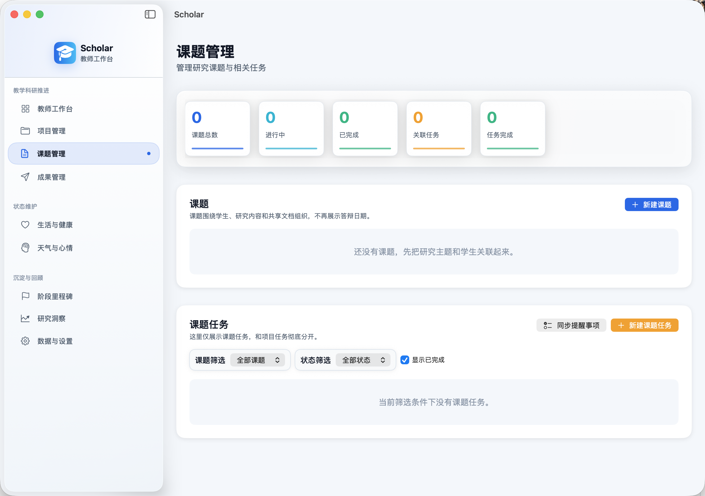
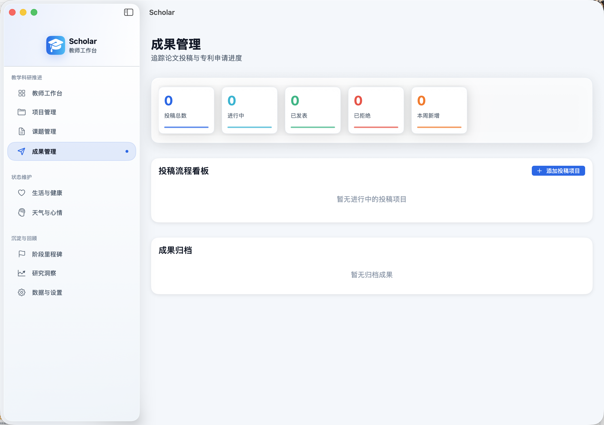

# Scholar

Scholar 是一款面向教师的本地优先 macOS 工作台。它把日常任务、项目推进、课题管理、成果投稿、健康记录和阶段回顾放在同一个桌面应用里，重点服务青年教师在科研、教学、学生指导与长期成果沉淀之间来回切换的真实工作节奏。

## 软件截图

### 教师工作台



### 项目管理



### 课题管理



### 成果管理




## 核心功能

- 教师工作台：把今天需要推进的任务和大概时间线前置，先回答“今天该做什么”。
- 项目管理：承接科研、教学、基金、学生指导和公共服务等长期工作线。
- 课题管理：围绕学生、研究主题和相关任务组织课题，不再和项目任务混用。
- 成果管理：跟踪论文、专利等成果从准备、投稿到归档的状态。
- 生活与健康：记录习惯和健康状态，帮助教师维持可持续的工作节奏。
- 天气与心情：保留轻量的状态记录，用于后续回顾。
- 阶段里程碑：沉淀阶段成果和长期进展。
- 研究洞察：从项目、课题、任务和成果中汇总阶段性数据。
- 数据与设置：管理语言、应用名称、提醒事项同步、数据导入导出和本地存储位置。

## 设计原则

- 本地优先：数据存放在用户选择的 workspace 文件夹中，不依赖云服务。
- 可检查：业务数据使用分类 JSON 文件保存，便于备份、查看和版本管理。
- 面向教师工作流：减少没有数据支撑的装饰性模块，把首页留给今日任务和时间线。
- 低打扰：任务、课题、成果、健康记录各自独立，避免不同类型事务混在一起。
- 可迁移：新版使用 `ScholarData`，同时兼容旧版 `PhDMasterWorkspaceData` 和旧 UserDefaults key。

## 数据存储

首次启动后，Scholar 会要求选择一个 workspace 文件夹。应用会记住该位置，下次启动时自动恢复。

在 workspace 中，Scholar 会创建数据目录，并按模块保存 JSON 分片：

```text
ScholarData/
  overview/
  projects/
  focus/
  thesis/
  outcomes/
  health/
  mental/
  milestones/
  attachments/
```

附件会复制到 workspace 内部，让整个项目数据保持自包含。

## 本地运行

### 使用 Xcode

1. 打开 `Scholar.xcodeproj`。
2. 选择 `Scholar` target。
3. 在 macOS 上 Build & Run。

### 使用 Swift Package Manager

```bash
cd Scholar
swift build
swift run Scholar
```

## 技术栈

- Swift 5.10
- SwiftUI
- AppKit 文件选择与系统集成
- 本地 JSON 持久化

## 项目结构

```text
Scholar/
  Models/
  Services/
  Utilities/
  ViewModels/
  Views/
  Resources/
```

## 当前状态

Scholar 仍在持续演进，目前更关注：

- 教师日常工作流是否顺手
- 首页是否真正服务“今天怎么安排”
- 项目、课题、成果和任务之间的边界是否清晰
- 本地数据是否稳定、透明、可迁移

## 后续方向

- 更完整的双语覆盖
- 更系统的数据迁移与修复工具
- 更丰富的趋势图表和阶段复盘
- 日历集成
- 附件预览与资料管理增强

